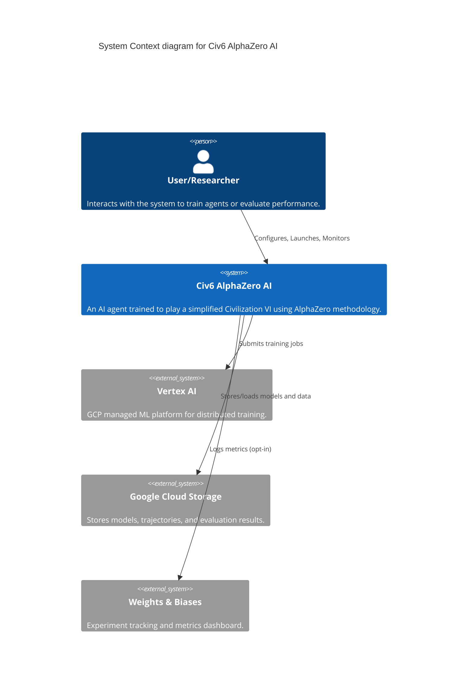
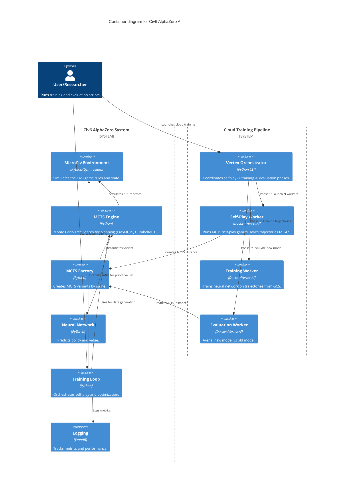
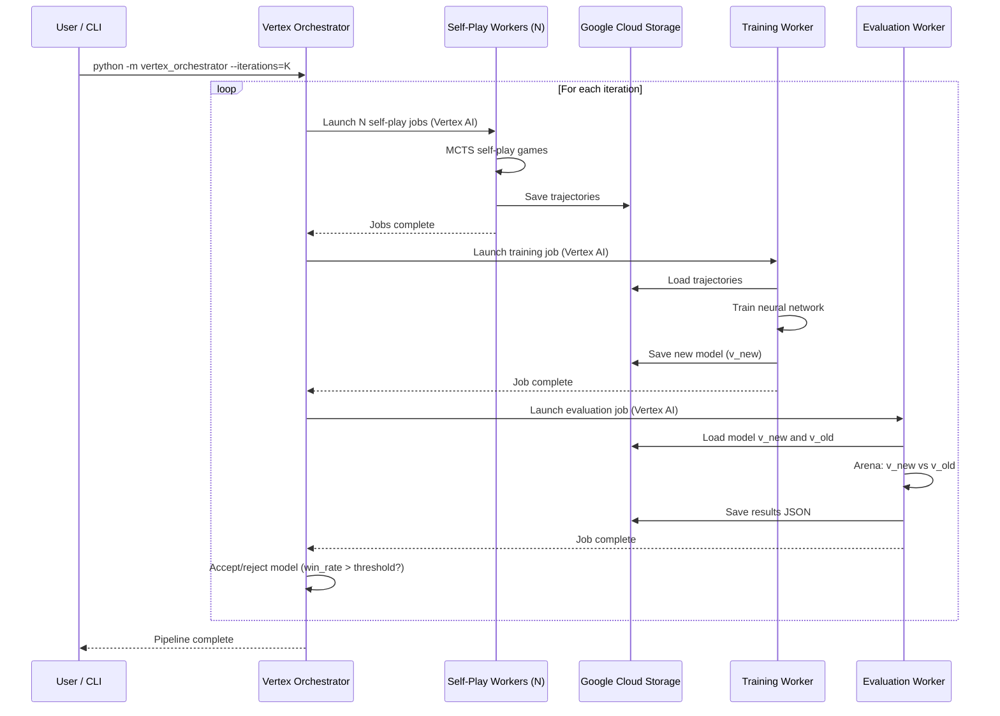

# C4 Architecture Documentation

## Context Diagram

```mermaid
C4Context
    title System Context diagram for Civ6 AlphaZero AI

    Person(user, "User/Researcher", "Interacts with the system to train agents or evaluate performance.")
    System(civ6_ai, "Civ6 AlphaZero AI", "An AI agent trained to play a simplified Civilization VI using AlphaZero methodology.")
    System_Ext(vertex, "Vertex AI", "GCP managed ML platform for distributed training.")
    System_Ext(gcs, "Google Cloud Storage", "Stores models, trajectories, and evaluation results.")
    System_Ext(wandb, "Weights & Biases", "Experiment tracking and metrics dashboard.")

    Rel(user, civ6_ai, "Configures, Launches, Monitors")
    Rel(civ6_ai, vertex, "Submits training jobs")
    Rel(civ6_ai, gcs, "Stores/loads models and data")
    Rel(civ6_ai, wandb, "Logs metrics (opt-in)")
```

## Container Diagram

```mermaid
C4Container
    title Container diagram for Civ6 AlphaZero AI

    Person(user, "User/Researcher", "Runs training and evaluation scripts")

    System_Boundary(c1, "Civ6 AlphaZero System") {
        Container(env, "MicroCiv Environment", "Python/Gymnasium", "Simulates the Civ6 game rules and state.")
        Container(mcts, "MCTS Engine", "Python", "Monte Carlo Tree Search for planning (Civ6MCTS, GumbelMCTS).")
        Container(factory, "MCTS Factory", "Python", "Creates MCTS variants by name.")
        Container(network, "Neural Network", "PyTorch", "Predicts policy and value.")
        Container(trainer, "Training Loop", "Python", "Orchestrates self-play and optimization.")
        Container(logger, "Logging", "WandB", "Tracks metrics and performance.")
    }

    System_Boundary(c2, "Cloud Training Pipeline") {
        Container(orchestrator, "Vertex Orchestrator", "Python CLI", "Coordinates selfplay -> training -> evaluation phases.")
        Container(selfplay, "Self-Play Worker", "Docker/Vertex AI", "Runs MCTS self-play games, saves trajectories to GCS.")
        Container(training, "Training Worker", "Docker/Vertex AI", "Trains neural network on trajectories from GCS.")
        Container(evaluation, "Evaluation Worker", "Docker/Vertex AI", "Arena: new model vs old model.")
    }

    Rel(user, trainer, "Starts local training")
    Rel(user, orchestrator, "Launches cloud training")
    Rel(trainer, env, "Interacts with")
    Rel(trainer, mcts, "Uses for data generation")
    Rel(mcts, network, "Queries for priors/values")
    Rel(mcts, env, "Simulates future states")
    Rel(trainer, logger, "Logs metrics")
    Rel(factory, mcts, "Instantiates variant")

    Rel(orchestrator, selfplay, "Phase 1: Launch N workers")
    Rel(orchestrator, training, "Phase 2: Train on trajectories")
    Rel(orchestrator, evaluation, "Phase 3: Evaluate new model")
    Rel(selfplay, factory, "Creates MCTS instance")
    Rel(evaluation, factory, "Creates MCTS instance")
```

## Cloud Training Pipeline

```mermaid
sequenceDiagram
    participant U as User / CLI
    participant O as Vertex Orchestrator
    participant SP as Self-Play Workers (N)
    participant GCS as Google Cloud Storage
    participant TR as Training Worker
    participant EV as Evaluation Worker

    U->>O: python -m vertex_orchestrator --iterations=K
    loop For each iteration
        O->>SP: Launch N self-play jobs (Vertex AI)
        SP->>SP: MCTS self-play games
        SP->>GCS: Save trajectories
        SP-->>O: Jobs complete

        O->>TR: Launch training job (Vertex AI)
        TR->>GCS: Load trajectories
        TR->>TR: Train neural network
        TR->>GCS: Save new model (v_new)
        TR-->>O: Job complete

        O->>EV: Launch evaluation job (Vertex AI)
        EV->>GCS: Load model v_new and v_old
        EV->>EV: Arena: v_new vs v_old
        EV->>GCS: Save results JSON
        EV-->>O: Job complete

        O->>O: Accept/reject model (win_rate > threshold?)
    end
    O-->>U: Pipeline complete
```
